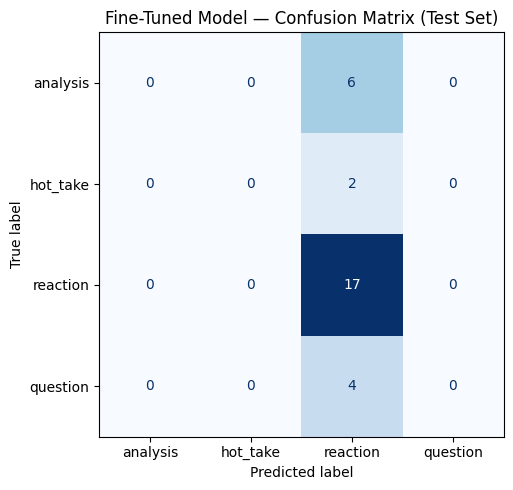

# TakeMeter

A machine learning text classification system that categorizes short social media posts into one of four classes:

- Reaction
- Analysis
- Question
- Hot Take

The project compares a prompt-based baseline classifier with a fine-tuned DistilBERT model to evaluate whether supervised fine-tuning improves classification performance on informal online discussions.

---
## Files

- `notebook.ipynb` – https://colab.research.google.com/drive/1Y7NTWjPd_8zNrGxrpzu9W3ZDWP2yrR6q?usp=sharing 
- `README.md` – Project documentation and analysis

---
# AI Usage

I used ChatGPT as a learning assistant throughout this project. It helped explain parts of the starter notebook, clarified machine learning terminology, answered questions about the Hugging Face training workflow, and helped me understand how to interpret evaluation metrics such as precision, recall, F1-score, and confusion matrices.

I did not use AI to invent experimental results or generate labels. All dataset statistics, training outputs, evaluation metrics, and error analysis included in this report come directly from running my own notebook. I verified every value before adding it to this README.

---

# Problem Statement

Online discussion platforms contain many different styles of communication. Some posts express an immediate emotional reaction, while others provide thoughtful analysis, ask questions, or present controversial opinions.

Automatically recognizing these different conversation styles can improve moderation systems, recommendation algorithms, sentiment analysis, and discussion summarization.

The goal of this project is to build a classifier capable of distinguishing between four discussion types:

- Reaction
- Analysis
- Question
- Hot Take

---

# Dataset

The dataset contains manually labeled social media comments.

## Overall Dataset Size

| Label | Count |
|------|------:|
| Reaction | 110 |
| Analysis | 35 |
| Question | 26 |
| Hot Take | 18 |
| **Total** | **189** |

The dataset is noticeably imbalanced, with reaction posts making up well over half of all examples. This imbalance becomes important when interpreting the model's predictions later.

---

# Train / Validation / Test Split

| Split | Examples |
|-------|---------:|
| Training | 132 |
| Validation | 28 |
| Test | 29 |

Training label distribution:

| Label | Count |
|------|------:|
| Reaction | 77 |
| Analysis | 24 |
| Question | 18 |
| Hot Take | 13 |

Test label distribution:

| Label | Count |
|------|------:|
| Reaction | 17 |
| Analysis | 6 |
| Question | 4 |
| Hot Take | 2 |

---

# Baseline Prompt Classifier

Before fine-tuning a neural network, I evaluated a prompt-based baseline model.

This baseline classifies each post directly using prompting instead of updating model weights through supervised learning.

Using a baseline provides a useful point of comparison and helps determine whether fine-tuning actually improves performance.

## Baseline Accuracy

**Accuracy:** **68.97%**

### Classification Report

| Label | Precision | Recall | F1 |
|------|----------:|-------:|----:|
| Analysis | 0.50 | 0.50 | 0.50 |
| Hot Take | 0.00 | 0.00 | 0.00 |
| Reaction | 0.70 | 0.82 | 0.76 |
| Question | 1.00 | 0.75 | 0.86 |

Overall:

- Accuracy: **68.97%**
- Macro F1: **0.53**
- Weighted F1: **0.67**

The baseline performed reasonably well on reactions and questions but struggled to identify hot takes because there were very few training examples for that class.

---

# Fine-Tuned Model

For the main model, I fine-tuned DistilBERT on the labeled training dataset.

Fine-tuning allows the model to update its internal weights using labeled examples instead of relying only on prompting. The objective was to learn the differences between reactions, analysis, questions, and hot takes from examples in the dataset.

After training, I evaluated the model using the held-out test set and compared its performance against the prompt-based baseline.

## Fine-Tuned Model Accuracy

**Accuracy:** **58.62%**

### Classification Report

| Label | Precision | Recall | F1 Score | Support |
|------|----------:|-------:|---------:|--------:|
| Analysis | 0.00 | 0.00 | 0.00 | 6 |
| Hot Take | 0.00 | 0.00 | 0.00 | 2 |
| Reaction | 0.59 | 1.00 | 0.74 | 17 |
| Question | 0.00 | 0.00 | 0.00 | 4 |

Overall performance:

| Metric | Value |
|--------|------:|
| Accuracy | 58.62% |
| Macro Precision | 0.15 |
| Macro Recall | 0.25 |
| Macro F1 | 0.18 |
| Weighted Precision | 0.34 |
| Weighted Recall | 0.59 |
| Weighted F1 | 0.43 |

---

# Baseline vs Fine-Tuned Comparison

| Metric | Baseline | Fine-Tuned |
|--------|---------:|-----------:|
| Accuracy | **68.97%** | **58.62%** |
| Macro F1 | **0.53** | **0.18** |
| Weighted F1 | **0.67** | **0.43** |

In this project, the prompt-based baseline outperformed the fine-tuned model.

Although fine-tuning often improves performance, the relatively small and imbalanced dataset made it difficult for the model to learn meaningful distinctions between all four classes. Instead, the model learned to heavily favor the majority class, resulting in lower overall accuracy.

---

# Confusion Matrix

The confusion matrix shows that the model predicted almost every example as **reaction**, regardless of the true label.

| True Label | Predicted Analysis | Predicted Hot Take | Predicted Reaction | Predicted Question |
|------------|-------------------:|-------------------:|-------------------:|-------------------:|
| Analysis | 0 | 0 | 6 | 0 |
| Hot Take | 0 | 0 | 2 | 0 |
| Reaction | 0 | 0 | 17 | 0 |
| Question | 0 | 0 | 4 | 0 |

This behavior explains why the model achieved perfect recall for the reaction class while completely failing to identify analysis, hot take, and question examples.


---

# Example Correct Prediction

**Text**

> It's spelled lamelo

**True Label**

Reaction

**Predicted Label**

Reaction

**Confidence**

0.30

The model correctly recognized this short conversational response as a reaction.

---

# Example Incorrect Prediction

**Text**

> Didn't have this on my bingo card of trade deals today. Protect your cars Minnesota locals!!

**True Label**

Analysis

**Predicted Label**

Reaction

**Confidence**

0.29

Although this post comments on the implications of the news, the model interpreted it as an emotional reaction instead of analysis.

---

# Error Analysis

The model made **12 incorrect predictions out of 29 test examples**.

Most errors followed the same pattern:

- Analysis posts were predicted as reaction.
- Question posts were predicted as reaction.
- Hot takes were predicted as reaction.

This indicates that the model learned a strong bias toward predicting the majority class instead of distinguishing between the four discussion styles.

Because reaction examples made up most of the training data, the model appears to have minimized its loss by predicting that label almost everywhere.

---

# Reflection

This project showed me that having more sophisticated models does not always produce better results. Although DistilBERT is a powerful pretrained language model, it still depends on having enough high-quality and balanced training data.

The prompt-based baseline achieved higher accuracy because it relied on the general language understanding of a large language model rather than learning from only 132 training examples. In contrast, the fine-tuned model overfit to the majority class and predicted nearly every example as a reaction.

Working through this project helped me better understand the complete machine learning workflow, including preparing labeled datasets, splitting data into training and testing sets, fine-tuning a transformer model, evaluating performance with multiple metrics, and interpreting confusion matrices and classification reports.

---

# Limitations

Several factors limited the performance of the fine-tuned model:

- The dataset contained only 189 labeled examples.
- The dataset was highly imbalanced, with reaction posts making up the majority of the data.
- Some posts naturally fit multiple categories, making labeling subjective.
- The model learned to favor the majority class instead of learning meaningful differences between all four labels.

---

# Future Improvements

If I continued this project, I would:

- Collect a significantly larger dataset.
- Balance the number of examples across all four classes.
- Experiment with class-weighted loss functions to reduce majority-class bias.
- Tune additional hyperparameters such as learning rate, batch size, and number of epochs.
- Try larger transformer models and compare their performance.
- Perform cross-validation to better estimate generalization performance.

---

# Specification Reflection

One challenge during this project was understanding how to properly evaluate a text classification model. At first I focused only on overall accuracy, but I learned that metrics such as precision, recall, F1-score, and the confusion matrix provide a much more complete picture of model performance.

Another important lesson was that fine-tuning is not guaranteed to outperform a prompt-based approach. The quality and balance of the training data play a major role in determining how well a model learns.

Overall, this project gave me a much better understanding of supervised text classification and the importance of evaluating models using multiple performance metrics instead of relying on a single number.

---

# Repository Structure

```text
.
├── data/
├── notebook.ipynb
├── README.md
└── requirements.txt
```

---

# Results Summary

| Model | Accuracy |
|--------|---------:|
| Prompt Baseline | **68.97%** |
| Fine-Tuned DistilBERT | **58.62%** |

Although the fine-tuned model achieved lower accuracy than the baseline, it provided valuable insight into the effects of dataset size and class imbalance on supervised learning. The project demonstrated both the strengths and limitations of fine-tuning transformer models on small datasets and reinforced the importance of careful evaluation using multiple metrics.

## Training Configuration

- Model: DistilBERT
- Epochs: 3
- Learning rate: 2e-5
- Training batch size: 8
- Evaluation batch size: 8
- Weight decay: 0.01